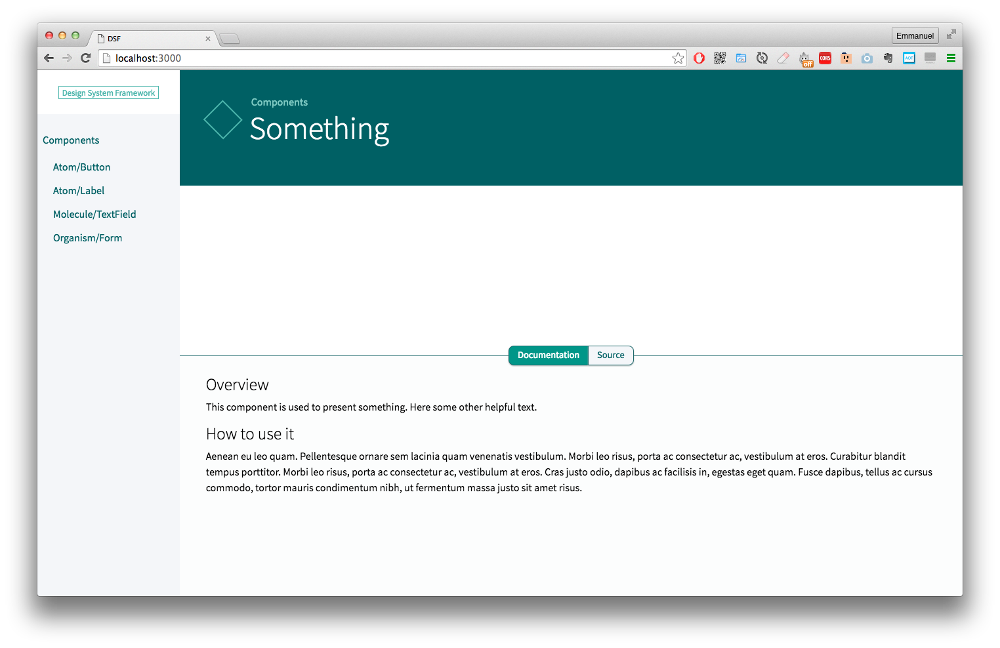

# Design System Framework

Build living styleguides and make sure they stay up to date.




---

**Note: This is an alpha release, not all features are fully available**

---


## What is this ?

Design System Framework (DSF) helps **developers**, **designers** and **editors** to use design systems in the best way possible:

### For developers

#### Keep sources separate


The only requirement is that you use one folder per component, the rest is up to you. Simply tell DSF how to find your HTML, CSS and JS:

```json
{
	"css": "*.css",
	"html": "*.hbs",
	"config": "config.json"
}
```

#### No hard coded values

The sources you work on in DSF is the code you are going to use in the application code (html, css, js). As such, templates already use variables:

```handlebars
<div class="textfield">
	{{> Atom/Label id=id text=label}}
	<input type="text" id="{{id}}" class="textfield__field">
</div>
```

This allows to never use hard coded values: they tend to be too perfect. DFS will also help you test your components with different values to make sure your components support names such as _Hubert Blaine Wolfeschlegelsteinhausenbergerdorff_.

Handlebars is used for templating.

#### The styleguide is alive

DFS does more than generate a styleguide from your sources: it actively watches you work and rebuilds anything that needs to. You should never have to touch your browser again.

For each component DFS provides always-up-to-date HTML, CSS and JS files. These files are "standalone": they contain your base code (reset.css, your favorite CSS/JS framework) and the component's code. This way you can test faster with lighter setup and _cherry on the cake_: make sure your compnents do not depend on each other (tight-coupling).

#### Dependency management

DFS understands your component dependencies and will always build what you need, only what you need.

#### Build production code

Provided a small configuration, DFS can generate the smallest files possible for production. Since it enforces the separation of components, it can easily generate 2 version of external assets: the critical path (to be inlined) and the rest (to be loaded asynchronously).


**Also:**

- Makes refactoring much easier
- Reinforces re-use of components
- Backend agnostic
- Generates test files for all components
- Statistics for each component:
  - code size
  - dependencies


### For designers and editors

#### Up to date documentation

An up-to-date documentation of the design system is an invaluable assets for designers and editors. By using the styleguide sources as the project sources, it's simply impossible for the styleguide to be out of date.

#### Quickly test copy

A living styleguide allows you to test the limits of components: _does this title fit in our homepage ?_ You can simply test your copy in an actual browser, using the actual production code with no programming knowledge needed.


## Getting started

### 1. You need a project with all components in a single directory

If you need one, just clone this example: https://github.com/lipsumar/dsf-example-project

`$ git clone https://github.com/lipsumar/dsf-example-project.git`


### 2. Install DSF

At the root of your project, run:

`$ npm install design-system-framework`

### 3. Run DSF

`$ node node_modules/design-system-framework/cli.js`

To make things easier, you can setup the following npm script in your `package.json`:

```json
  "scripts": {
    "dsf": "node node_modules/design-system-framework/cli.js"
  },
```

and simply run:

`$ npm run dsf`


## Configuration

You can configure DSF via a file called `options.json` at the root of your project.

### `components-path`

**Default**: `"Components/"`

The path to a directory containing your components.

**Example**:

```json
{
	"components-path": "src/components"
}
```

### `component-path` (singular)

**Default**: _none_

The path to a directory containing **a single** component.

**Example**:

```json
{
	"component-path": "node_modules/normalize.css/"
}
```


### `external-components`

**Default**: _none_

An object containing other components, such as a CSS reset or framework.

The key is the name of the component (whatever you like) and the value is the same configuration as this one.

**Example**:

```json
{
	"external-components": {
		"normalize.css": {
			"component-path": "node_modules/normalize.css/"
		}
	}
}
```


### `base`

Allows to define some components as a base for all the others. This is typically a CSS framework or reset.

**Default**: _none_

An object containing a `css` and `js` keys. The value is an array of component names.

The components must be defined via `components-path` or `external-components`

**Example**:

```json
{
	"base":{
		"css": [
			"normalize.css"
		]
	}
}
// note: only CSS is supported at the moment
```

